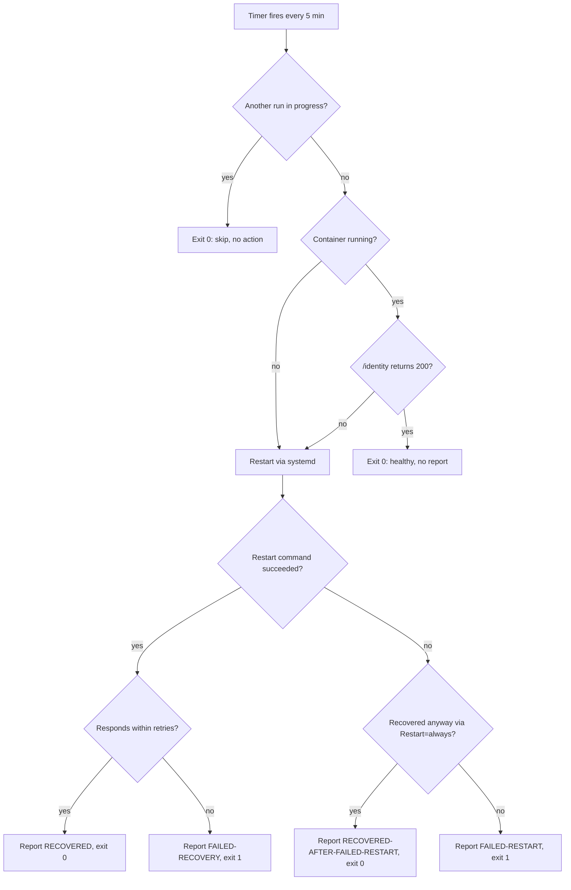

# Plex Health-Check & Report-Clearing System

Automated monitoring for the rootless-Podman **Plex** container. The Plex Quadlet
unit auto-restarts the container on any exit or crash (`Restart=always`); a
systemd user timer adds a second layer, checking Plex every 5 minutes and
restarting it if it is down or unresponsive, recording every such restart to a
report log. A second timer clears that report log once a month.

Everything runs as the `adrian` user via the **systemd user manager**. Lingering
is enabled (`loginctl enable-linger adrian`), so the timers run even when no one
is logged in.

## Components

| File | Purpose |
| --- | --- |
| `~/Podman/plex-healthcheck.sh` | Checks Plex health; restarts + reports if unhealthy. |
| `~/Podman/plex-report-clear.sh` | Truncates the report log and writes a fresh header. |
| `~/Podman/plex-healthcheck-report.log` | The report log (one line per restart). |
| `plex-healthcheck.{service,timer}.example` | Sanitized templates of the health-check units; the live units are not tracked in git. |
| `plex-report-clear.{service,timer}.example` | Sanitized templates of the monthly report-clear units. |
| `~/.config/systemd/user/plex-healthcheck.{service,timer}` | Runs the health-check every 5 min. |
| `~/.config/systemd/user/plex-report-clear.{service,timer}` | Clears the report log monthly. |
| `~/.config/containers/systemd/plex.container` | The Quadlet unit that defines the Plex container (generates `plex.service`). |

> Note: `~/Podman` is a symlink to `/KoolApps/Podman`.

## How it works

The health-check (`plex-healthcheck.sh`) considers Plex healthy only when **both**
are true:

1. The `plex` container is running (`podman ps`).
2. Plex answers `HTTP 200` on `http://127.0.0.1:32400/identity` (no auth required).

If either check fails, it restarts Plex and waits up to
`POST_RESTART_RETRIES × POST_RESTART_DELAY` (default **120s**) for it to respond,
then records the outcome to the report log.

Runs are serialised by a non-blocking `flock` on `$XDG_RUNTIME_DIR/plex-healthcheck.lock`.
If a previous run is still going, the new one logs and exits `0` without acting —
see the 2026-09-05 note below for why this matters.



### Restarting the right way (important)

The Plex container is managed by a **Quadlet** unit and runs with auto-remove, so
it is *deleted* when stopped. A plain `podman restart plex` therefore fails once
the container is gone. The script restarts Plex through systemd instead:

```bash
systemctl --user restart plex.service
```

This is controlled by `RESTART_MODE=auto` (the default): it uses systemd when the
unit exists and falls back to `podman restart` only if it does not.

### Two layers of recovery

Recovery does not rely on the health-check alone:

1. **systemd `Restart=always` (primary).** The Quadlet unit
   (`~/.config/containers/systemd/plex.container`) sets `Restart=always` with
   `RestartSec=10`, so systemd restarts the container within ~10s of *any* exit,
   crash, or failed start — including the first attempt after a reboot.
2. **Health-check timer (backstop).** The 5-minute timer additionally catches the
   case systemd cannot see — a container that is *running but unresponsive* on
   `/identity` — and restarts it via `systemctl --user restart plex.service`.

> **Fixed 2026-06-27:** the unit previously used `Restart=unless-stopped`, a
> Podman/Docker value that systemd cannot parse (`Failed to parse
> Restart=unless-stopped, ignoring: Invalid argument`). systemd therefore never
> auto-restarted Plex, so a failed start after a reboot left it down until the
> next health-check run (~5 min). Corrected to the systemd-native
> `Restart=always` + `RestartSec=10`. Verified with `podman kill plex`: systemd
> recreated the container and `NRestarts` incremented (journal: `Scheduled
> restart job, restart counter is at 1`).

> **Fixed 2026-09-05:** an unresponsive Plex exposed two flaws in the
> health-check itself. The Plex process wedged in uninterruptible sleep (D
> state) and survived both `SIGTERM` and repeated `SIGKILL`, so
> `systemctl --user restart plex.service` failed outright — journal showed
> `given PID did not die within timeout`, `Processes still around after final
> SIGKILL. Entering failed mode.` and `Failed to spawn executor: Device or
> resource busy`. Two problems followed:
>
> 1. **False failure reports.** The script exited `1` with `FAILED-RESTART` the
>    moment the restart command failed, without checking the actual outcome.
>    Because the Quadlet unit is `Restart=always`, systemd brought Plex back
>    ~10s later regardless — so a server that recovered was recorded as a failed
>    reset (two such entries on 2026-09-05, at 19:47:04 and 19:48:54; Plex was
>    up at 19:49:04). The script now waits for recovery on that path and reports
>    `RECOVERED-AFTER-FAILED-RESTART`.
> 2. **Restart storms.** `systemctl restart` blocked for 6m46s while the
>    container was wedged. systemd queued the next timer job, which fired a
>    second, competing restart the instant the first returned — interrupting an
>    in-progress start and prolonging the outage. Runs are now serialised with a
>    non-blocking `flock`.
>
> Also hardened: the restart command is bounded by `timeout`
> (`PLEX_RESTART_TIMEOUT`, default 150s), the recovery window was doubled to
> 120s, and `TimeoutStartSec=600` added to `plex-healthcheck.service` as an
> outer backstop. Note the trigger was load-induced, not a Plex defect: a
> full library scan had queued chapter-thumbnail generation, saturating I/O on
> the storage array.

## Schedules

| Timer | Schedule | `OnCalendar` |
| --- | --- | --- |
| `plex-healthcheck.timer` | Every 5 minutes (`:00, :05, …`) | `*:0/5` |
| `plex-report-clear.timer` | 1st of each month, 00:00 local | `monthly` |

Both use `Persistent=true`, so a run missed while the machine was off is executed
at the next opportunity.

## Report log format

A line is appended **only when Plex is reset** (a healthy run writes nothing here;
its play-by-play goes to the journal instead). Each entry is `key=value`:

```text
# Plex reset report — one line per restart performed by plex-healthcheck.sh
2026-06-23 09:50:54 +0100  RESET  result=RECOVERED  reason="container 'plex' not running"  attempts=2  duration=10s  host=KoolApps
```

`result` is one of:

- `RECOVERED` — restarted and Plex came back.
- `RECOVERED-AFTER-FAILED-RESTART` — the restart command failed, but Plex came
  back anyway (systemd's `Restart=always` won the race). Not an error, though
  worth investigating why the restart command failed.
- `FAILED-RECOVERY` — restarted but still not responding within the retry window.
- `FAILED-RESTART` — the restart command failed *and* Plex did not recover.

The monthly clear truncates this file to just its header plus a `# Cleared: <timestamp>` line.

## Configuration

All settings are environment-variable overrides; defaults work for this host.

### `plex-healthcheck.sh`

| Variable | Default | Meaning |
| --- | --- | --- |
| `PLEX_CONTAINER` | `plex` | Container name. |
| `PLEX_HOST` | `127.0.0.1` | Host for the health probe. |
| `PLEX_PORT` | `32400` | Plex port. |
| `CURL_TIMEOUT` | `10` | Seconds per health request. |
| `POST_RESTART_RETRIES` | `24` | Probe attempts after a restart. |
| `POST_RESTART_DELAY` | `5` | Seconds between attempts. |
| `PLEX_RESTART_TIMEOUT` | `150` | Max seconds for the restart command before giving up on it. |
| `PLEX_HEALTH_LOCK` | `$XDG_RUNTIME_DIR/plex-healthcheck.lock` | Lock file serialising concurrent runs. |
| `PLEX_HEALTH_LOG` | _(empty)_ | Optional extra log file; empty = stdout/journal only. |
| `PLEX_HEALTH_REPORT` | `~/Podman/plex-healthcheck-report.log` | Report log path. |
| `PLEX_RESTART_MODE` | `auto` | `auto` \| `systemd` \| `podman`. |
| `PLEX_SYSTEMD_UNIT` | `plex.service` | Unit restarted in systemd mode. |
| `PLEX_SYSTEMCTL_SCOPE` | `--user` | `--user` (rootless) or empty (system). |

Exit codes: `0` healthy/recovered · `1` unhealthy, not recovered · `2` environment error (e.g. `podman` missing).

### `plex-report-clear.sh`

| Variable | Default | Meaning |
| --- | --- | --- |
| `PLEX_HEALTH_REPORT` | `~/Podman/plex-healthcheck-report.log` | Report log to clear (matches the health-check). |

## Common operations

```bash
# Status & schedules
systemctl --user list-timers 'plex-*'
systemctl --user status plex-healthcheck.timer

# Run an immediate health check (restarts Plex if needed)
systemctl --user start plex-healthcheck.service

# Follow the health-check log (live)
journalctl --user -u plex-healthcheck.service -f

# View the restart report
cat ~/Podman/plex-healthcheck-report.log

# Clear the report now (on demand)
systemctl --user start plex-report-clear.service

# Pause / resume automatic checks
systemctl --user disable --now plex-healthcheck.timer
systemctl --user enable  --now plex-healthcheck.timer
```

After editing any unit file, reload the manager:

```bash
systemctl --user daemon-reload
```

## Troubleshooting

- **Client can't see the server, but the server is fine.** Confirm the server is
  reachable on the LAN: `curl -sI http://<server-ip>:32400/identity` should return
  `200`. If it does, the issue is client-side discovery (different subnet/VLAN,
  Tailscale, etc.), not the server.
- **Health check keeps restarting Plex.** Inspect why it is judged unhealthy:
  `journalctl --user -u plex-healthcheck.service --since '1 hour ago'`. Increase
  `POST_RESTART_RETRIES` if Plex simply needs longer to start.
- **Restart fails.** Make sure `plex.service` loads:
  `systemctl --user status plex.service`. The container is Quadlet-managed, so
  always control it via systemd, never `podman start/stop/restart`.
- **Plex stayed down after a reboot/crash.** Confirm systemd's auto-restart is
  active: `systemctl --user show plex.service -p Restart` must print
  `Restart=always`. If not, check the `[Service]` section of `plex.container`
  (it must be a systemd value, *not* `unless-stopped`) and run
  `systemctl --user daemon-reload`.
- **Container stuck `stopping`; Plex will not die.** If the journal shows
  `given PID did not die within timeout` or `Processes still around after final
  SIGKILL`, the Plex process is in uninterruptible sleep (D state), blocked in a
  kernel I/O call — typically heavy background work such as chapter-thumbnail
  generation against slow storage. Neither systemd nor podman can kill a D-state
  process; it clears only once the I/O completes. Let `Restart=always` recreate
  the container rather than issuing further restarts, which merely compete with
  the recovery. To reduce recurrence, disable chapter thumbnail generation in
  Plex's settings (Settings → Library).

## Uninstall

```bash
systemctl --user disable --now plex-healthcheck.timer plex-report-clear.timer
rm ~/.config/systemd/user/plex-healthcheck.{service,timer}
rm ~/.config/systemd/user/plex-report-clear.{service,timer}
systemctl --user daemon-reload
# Optional: remove the scripts and report log
rm ~/Podman/plex-healthcheck.sh ~/Podman/plex-report-clear.sh ~/Podman/plex-healthcheck-report.log
```
