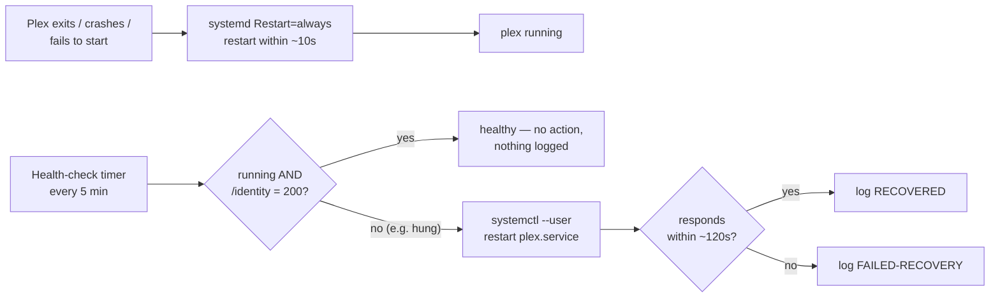

# Podman Plex — Health-Check & Auto-Restart

Automation that keeps the rootless-[Podman](https://podman.io/) **Plex Media Server**
container (`plex`) running on this host: it recovers Plex automatically when the
container stops **or** stops responding, and logs every recovery.

This README focuses on the **automation** and the **recovery process**. The full
reference — every configuration variable, troubleshooting, and uninstall steps —
is in [`PLEX-HEALTHCHECK.md`](./PLEX-HEALTHCHECK.md).

## Getting Started
1. **Clone** this repo: `git clone https://github.com/adr41n/podman-plex-healthcheck.git`
2. **Deploy Plex** from the Quadlet template — see [Deploying / editing the Quadlet](#deploying--editing-the-quadlet).
3. **Install the scripts**: place `plex-healthcheck.sh` and `plex-report-clear.sh` in `~/Podman` (or adjust the `ExecStart=` lines in the unit templates to match).
4. **Install the units** from the sanitized templates:
   ```bash
   mkdir -p ~/.config/systemd/user
   for u in plex-healthcheck.service plex-healthcheck.timer \
            plex-report-clear.service plex-report-clear.timer; do
     cp "$u.example" ~/.config/systemd/user/"$u"
   done
   systemctl --user daemon-reload
   ```
5. **Enable** the timers, with lingering so they run while logged out:
   `systemctl --user enable --now plex-healthcheck.timer plex-report-clear.timer && loginctl enable-linger "$USER"`
6. **Verify**: `systemctl --user list-timers 'plex-*'` (and `systemctl --user show plex.service -p Restart` should print `Restart=always`).

## Components
| File | Role |
| --- | --- |
| `plex-healthcheck.sh` | Health probe + restart/report logic (runs every 5 min). |
| `plex-report-clear.sh` | Truncates the recovery report log (runs monthly). |
| `plex-healthcheck.{service,timer}.example` | Sanitized **templates** of the health-check units. Copy to `~/.config/systemd/user/`. The live units are **not** tracked. |
| `plex-report-clear.{service,timer}.example` | Sanitized **templates** of the monthly report-clear units. |
| `Plex/plex.container.example` | Sanitized **template** of the Quadlet unit. Copy it to `~/.config/containers/systemd/plex.container` and fill in the placeholders. The real, host-specific unit is intentionally **not** tracked. |
| `plex-healthcheck-report.log` | Runtime recovery log — one line per reset (not tracked in git). |

Everything runs as the `adrian` user via the **systemd user manager**, with
lingering enabled (`loginctl enable-linger adrian`) so the timers run even when
no one is logged in. The unit/timer files live under `~/.config/systemd/user/`
and `~/.config/containers/systemd/`.

## Recovery process (two independent layers)
Recovery does **not** rely on a single mechanism:

1. **systemd `Restart=always` — primary, ~10 s.**
   The Quadlet unit sets `Restart=always` with `RestartSec=10`, so systemd
   restarts the container within ~10 seconds of *any* exit, crash, or failed
   start — including the first attempt after a reboot.
2. **Health-check timer — backstop, every 5 min.**
   `plex-healthcheck.sh` catches what systemd cannot see: a container that is
   *running but unresponsive*. Plex is considered healthy only when **both** are
   true:
   - the `plex` container is running (`podman ps`), and
   - Plex answers `HTTP 200` on `http://127.0.0.1:32400/identity` (no auth).

   If either check fails, it restarts Plex via `systemctl --user restart
   plex.service`, waits up to ~120 s for it to respond, then appends one line to
   the report log. Concurrent runs are serialised by a lock, so a slow run never
   leaves a queued job that fires a competing restart.



### Why it restarts via systemd (not `podman restart`)
The container is **Quadlet-managed** and runs with auto-remove, so it is *deleted*
when it stops — a plain `podman restart plex` fails once the container is gone.
Always control it through systemd:

```bash
systemctl --user restart plex.service
```

## Automation (systemd user timers)
| Timer | Schedule | Runs |
| --- | --- | --- |
| `plex-healthcheck.timer` | every 5 min (`OnCalendar=*:0/5`) | `plex-healthcheck.sh` |
| `plex-report-clear.timer` | monthly | `plex-report-clear.sh` |

Both use `Persistent=true`, so a run missed while the host was off executes at the
next opportunity.

## Cron jobs
Three user-level cron jobs complement the systemd timers above:

| Schedule | Command | Purpose |
| --- | --- | --- |
| Every 5 min | `~/bin_local/CheckRequests` | Polls for pending requests. |
| Daily at 06:00 | `~/bin_local/SaveHome` | Daily Home Assistant backup. |
| 1st of month at 05:55 | `~/bin_local/ClearSaveHomeLog` | Clears the SaveHome log before the day's backup run. |

View or edit with `crontab -e`; verify with `crontab -l`.

### Verification (2026-06-28)
All three jobs were verified in production on `KoolApps`:
- **CheckRequests** — confirmed firing every 5 min without gaps from `10:25` to `18:35+`; dispatch logic tested: correctly ignores requests when an `-Active` flag is present and consumes the request file when not.
- **SaveHome** — confirmed dispatched at `18:36 BST` in response to a request file; execution confirmed via `/KoolApps/home/sudo-crontab.txt` being written at that timestamp.
- **ClearSaveHomeLog** — not yet due (next run: 1 July at 05:55); schedule verified in crontab.
- A 24-test bash suite (`test-cron-jobs.sh`) covers schedule correctness, script permissions/syntax, `ClearSaveHomeLog` cleanup logic, `CheckRequests` dispatch logic, and `SaveHome`'s flag-file guard — all tests pass.

## Recovery report log
A line is appended to `plex-healthcheck-report.log` **only when Plex is reset**;
healthy runs write nothing there (their play-by-play goes to the journal). Each
entry is `key=value`:

```text
2026-06-27 18:23:10 +0100  RESET  result=RECOVERED  reason="container 'plex' not running"  attempts=4  duration=18s  host=KoolApps
```

`result` is one of `RECOVERED`, `RECOVERED-AFTER-FAILED-RESTART`,
`FAILED-RECOVERY`, or `FAILED-RESTART`. The monthly clear truncates the file to
its header plus a `# Cleared: <timestamp>` line.

## Common operations
```bash
# Timer status / schedule
systemctl --user list-timers 'plex-*'

# Run a health check now (restarts Plex if needed)
systemctl --user start plex-healthcheck.service

# Follow the health-check log live
journalctl --user -u plex-healthcheck.service -f

# View the recovery report
cat plex-healthcheck-report.log

# Confirm systemd's primary auto-restart is in effect
systemctl --user show plex.service -p Restart      # -> Restart=always
```

## Deploying / editing the Quadlet
This repo ships a **sanitized template**, [`Plex/plex.container.example`](./Plex/plex.container.example),
rather than a real unit — the live unit is host-specific (private addresses, a
claim token) and is intentionally **not** tracked. To deploy:

```bash
mkdir -p ~/.config/containers/systemd
cp Plex/plex.container.example ~/.config/containers/systemd/plex.container
# edit the copy: set TZ, your volume paths, and PLEX_CLAIM (first run only)
systemctl --user daemon-reload
systemctl --user start plex
```

After any later edit to the live unit, re-run `systemctl --user daemon-reload`.

## License
Released under the [MIT License](./LICENSE) © 2026 adr41n.
